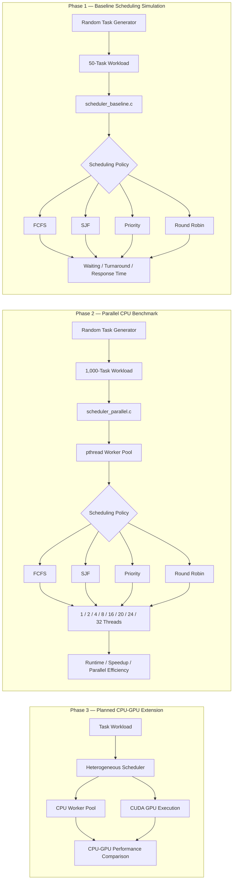
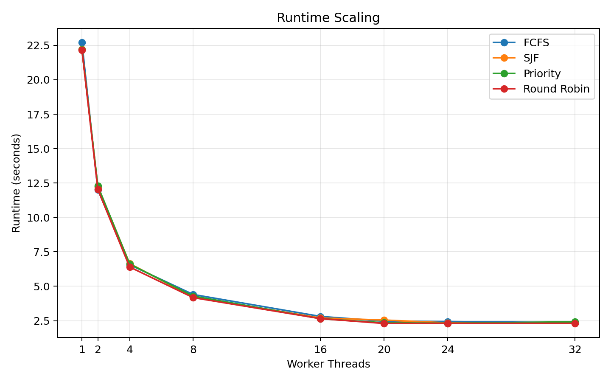
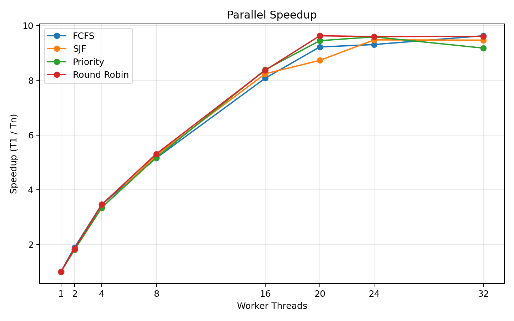
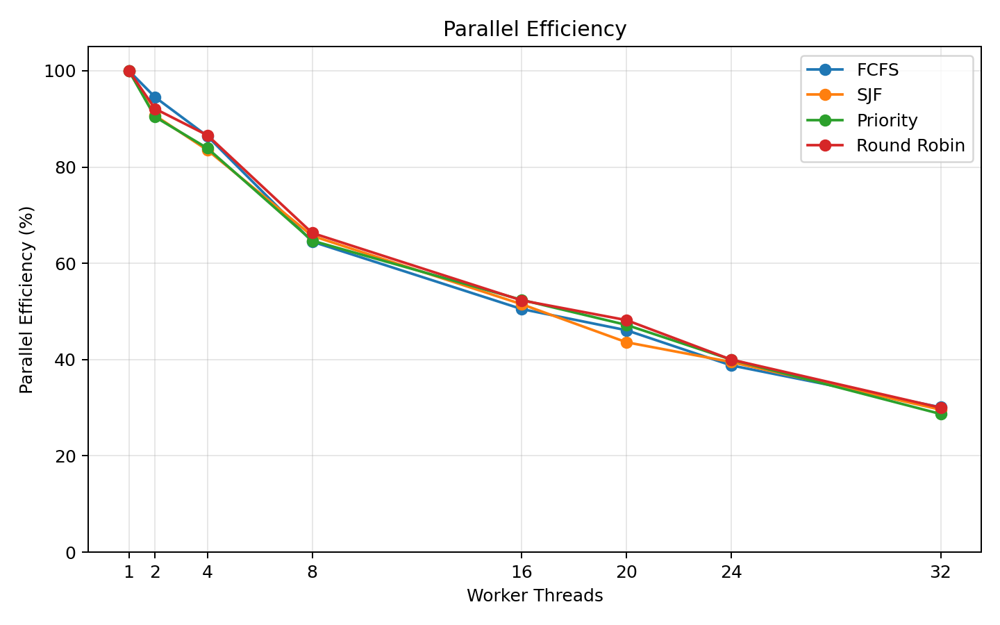

# CPU-GPU Scheduling Simulator

A C-based scheduling and parallel-computing project that evolves from a single-CPU scheduling simulator into a pthread-based multicore benchmark, with a planned CUDA-based CPU-GPU heterogeneous scheduling phase.

The current implementation contains two completed CPU stages:

- **`scheduler_baseline.c`** — single-CPU scheduling simulation with FCFS, SJF, Priority, and Round Robin.
- **`scheduler_parallel.c`** — pthread-based parallel execution of the same scheduling policies with scalability measurements from 1 to 32 worker threads.

> **Project status:** CPU baseline and multicore pthread phases are complete. GPU execution and CPU-GPU heterogeneous scheduling are planned as the next phase.

---

## Project Goals

This project was built to study two related questions:

1. **How do classical CPU scheduling policies behave in a single-CPU simulation?**
2. **How does real CPU-bound work scale when the scheduling logic is executed by multiple pthread workers?**

The longer-term goal is to extend the same framework into a heterogeneous scheduler that can route work to either CPU workers or CUDA kernels based on task characteristics and execution cost.

---

## System Architecture

The project is organized into three stages. The first two are implemented; the third is the planned CPU-GPU extension.



### Why the two CPU stages use different workload sizes

| Stage | Workload | Primary purpose |
|---|---:|---|
| Baseline simulator | 50 tasks | Keep task-level scheduling behavior and latency metrics readable |
| Parallel benchmark | 1,000 tasks | Provide enough CPU-bound work for meaningful scalability measurements |

The baseline and parallel stages intentionally use different workload sizes because they measure different things:

- **Baseline stage:** uses **50 tasks** so individual task parameters and scheduling metrics remain readable.
- **Parallel stage:** uses **1,000 tasks** to provide enough CPU-bound work for meaningful thread-scaling measurements.

---

## Hardware and Software Environment

The benchmark shown below was executed on the following development system.

| Component | Specification |
|---|---|
| Laptop | ASUS TUF Gaming F16 (FX607JU) |
| CPU | Intel Core i7-13650HX |
| Logical CPUs visible to WSL | 20 |
| System Memory | 16 GB RAM |
| Discrete GPU | NVIDIA GeForce RTX 4050 Laptop GPU |
| Dedicated GPU Memory | ~6 GB VRAM |
| Integrated GPU | Intel UHD Graphics |
| Host OS | Windows 11 Home 64-bit |
| Linux Environment | WSL2, Ubuntu 26.04 LTS |
| Language | C |
| Parallel Runtime | POSIX Threads (`pthread`) |
| Timing API | `clock_gettime(CLOCK_MONOTONIC)` |
| GPU Phase | CUDA planned; not used in the current benchmark |

The current performance results are **CPU-only**. The RTX 4050 is listed because it will be used in the next project phase, but it does not contribute to the results presented here.

---

# Phase 1 — Single-CPU Scheduling Simulator

## Implemented Scheduling Policies

### First-Come, First-Served (FCFS)

Tasks are sorted by arrival time and executed in arrival order. FCFS is simple and deterministic, but long tasks can delay shorter tasks that arrive later.

### Shortest Job First (SJF)

Among tasks that have already arrived, the scheduler selects the unfinished task with the smallest burst time. This generally reduces average waiting and turnaround time for the generated workload.

### Priority Scheduling

Among available tasks, the scheduler selects the task with the highest priority. In this implementation, a **smaller numeric value represents a higher priority**.

### Round Robin (RR)

Tasks are executed cyclically with a time quantum of **2 burst units**. This allows tasks to receive CPU service earlier, improving responsiveness at the cost of more frequent switching between tasks.

---

## Task Model

Each task contains:

```c
typedef struct {
    char id[6];
    int arrival_time;
    int burst_time;
    int remaining_time;
    int priority;
    int waiting_time;
    int turnaround_time;
    int completion_time;
    int response_time;
} Task;
```

The baseline program generates random task IDs and random scheduling parameters, then gives each scheduling algorithm an independent copy of the same workload so that the comparison is performed on identical input data.

---

## Baseline Metrics

The simulator computes:

- **Waiting Time** — total time spent waiting before execution.
- **Turnaround Time** — completion time minus arrival time.
- **Response Time** — time from arrival until the task first receives CPU service.
- **Completion Time** — simulated time at which the task finishes.

For the sample 50-task run used in this README:

| Algorithm | Avg. Waiting Time | Avg. Turnaround Time | Avg. Response Time |
|---|---:|---:|---:|
| FCFS | 81.96 | 87.40 | 81.96 |
| SJF | 54.26 | 59.70 | 54.26 |
| Priority | 92.58 | 98.02 | 92.58 |
| Round Robin | 128.58 | 134.02 | **4.94** |

### Baseline Observations

- **SJF produced the lowest average waiting and turnaround time** in this particular random workload because shorter tasks are selected earlier.
- **Round Robin produced the lowest response time by a large margin** because each ready task receives CPU time quickly instead of waiting for all earlier tasks to finish.
- The lower response time of Round Robin comes with a tradeoff: tasks may need several time slices before completion, which increases total waiting and turnaround time.
- FCFS response time equals its waiting time because each task runs to completion the first time it reaches the CPU.
- These values depend on the randomly generated workload and should be interpreted as one sample run rather than universal properties of the algorithms.

---

# Phase 2 — pthread Parallel Scheduler

The second stage replaces the purely simulated execution model with actual CPU-bound work executed by multiple pthread workers.

## Parallel Design

Each worker repeatedly:

1. Acquires the shared scheduling mutex.
2. Selects or dequeues one task according to the active scheduling mode.
3. Releases the mutex.
4. Executes synthetic CPU-bound work **outside the critical section**.
5. For Round Robin, reacquires the mutex to update `remaining_time`, requeue unfinished tasks, or increment the completion count.

Keeping the CPU-bound execution outside the mutex is essential. If the mutex were held while a task was executing, the program would effectively serialize the workload and lose multicore parallelism.

### Shared-State Synchronization

A single `pthread_mutex_t` protects shared scheduler state such as:

- the FCFS dispatch index,
- SJF/Priority task-selection state,
- the Round Robin queue,
- Round Robin completion counters,
- task `remaining_time` updates.

Round Robin uses a circular queue of **task indices** rather than copying complete `Task` objects into the queue. The authoritative task state remains in the shared task array.

---

## Synthetic CPU Workload

Each burst unit performs a CPU-bound loop:

```c
for (long long j = 0; j < 5000000; j++) {
    result += j % 7;
}
```

This converts each simulated burst into measurable real CPU work, making it possible to study multicore scaling with pthread workers.

The parallel benchmark uses **1,000 generated tasks** and evaluates:

```text
1, 2, 4, 8, 16, 20, 24, and 32 worker threads
```

---

# Parallel Benchmark Results

## Runtime

| Threads | FCFS (s) | SJF (s) | Priority (s) | Round Robin (s) |
|---:|---:|---:|---:|---:|
| 1 | 22.7036 | 22.2104 | 22.1941 | 22.1631 |
| 2 | 12.0063 | 12.2420 | 12.2761 | 12.0304 |
| 4 | 6.5670 | 6.6474 | 6.6160 | 6.4014 |
| 8 | 4.4014 | 4.2248 | 4.2865 | 4.1756 |
| 16 | 2.8088 | 2.6964 | 2.6463 | 2.6487 |
| 20 | 2.4629 | 2.5443 | 2.3491 | 2.3006 |
| 24 | 2.4390 | 2.3437 | 2.3146 | 2.3081 |
| 32 | 2.3572 | 2.3462 | 2.4187 | 2.3065 |



---

## Speedup

Speedup is calculated as:

```text
Speedup(N) = T1 / TN
```

where `T1` is the one-thread runtime and `TN` is the runtime using `N` worker threads.

| Threads | FCFS | SJF | Priority | Round Robin |
|---:|---:|---:|---:|---:|
| 1 | 1.00x | 1.00x | 1.00x | 1.00x |
| 2 | 1.89x | 1.81x | 1.81x | 1.84x |
| 4 | 3.46x | 3.34x | 3.35x | 3.46x |
| 8 | 5.16x | 5.26x | 5.18x | 5.31x |
| 16 | 8.08x | 8.24x | 8.39x | 8.37x |
| 20 | 9.22x | 8.73x | 9.45x | 9.63x |
| 24 | 9.31x | 9.48x | 9.59x | 9.60x |
| 32 | **9.63x** | 9.47x | 9.18x | **9.61x** |



The observed peak speedup is approximately **9.6x**.

---

## Parallel Efficiency

Parallel efficiency is calculated as:

```text
Efficiency(N) = Speedup(N) / N * 100%
```

| Threads | FCFS | SJF | Priority | Round Robin |
|---:|---:|---:|---:|---:|
| 1 | 100.0% | 100.0% | 100.0% | 100.0% |
| 2 | 94.5% | 90.7% | 90.4% | 92.1% |
| 4 | 86.4% | 83.5% | 83.9% | 86.6% |
| 8 | 64.5% | 65.7% | 64.7% | 66.3% |
| 16 | 50.5% | 51.5% | 52.4% | 52.3% |
| 20 | 46.1% | 43.6% | 47.2% | 48.2% |
| 24 | 38.8% | 39.5% | 40.0% | 40.0% |
| 32 | 30.1% | 29.6% | 28.7% | 30.0% |



---

# Performance Analysis

## 1. Strong scaling from 1 to 16 threads

Runtime decreases substantially as the worker count increases from 1 to 16 threads.

For example, Round Robin improves from:

```text
1 thread:   22.1631 s
16 threads:  2.6487 s
```

This corresponds to an **8.37x speedup**.

The workload is CPU-bound and contains many independent tasks, so additional workers can execute substantial portions of the workload concurrently.

---

## 2. Saturation near the available logical CPU count

The system exposes **20 logical CPUs** to WSL.

The benchmark begins to flatten around 20 worker threads:

```text
Round Robin
20 threads: 2.3006 s
24 threads: 2.3081 s
32 threads: 2.3065 s
```

At this point, adding more software threads does not add more hardware execution resources.

The 20-, 24-, and 32-thread results should therefore be viewed as the same general **saturation region**, not as evidence that 32 threads provide substantially more compute capability.

---

## 3. Why can 24 or 32 threads occasionally appear slightly faster?

A worker count above the number of visible logical CPUs can occasionally produce a slightly lower measured runtime, but the differences are small.

Possible causes include:

- operating-system scheduling variation,
- dynamic CPU frequency and boost behavior,
- background activity in Windows and WSL,
- cache-state variation,
- differences in load distribution near the end of the workload,
- measurement noise.

For example, FCFS measured:

```text
20 threads: 2.4629 s
24 threads: 2.4390 s
32 threads: 2.3572 s
```

This does **not** mean that 32 threads provide 32-way hardware parallelism. The system still exposes 20 logical CPUs. The result is better interpreted as normal variation inside the saturated performance region.

A more rigorous performance study would repeat each configuration multiple times and report the mean and standard deviation.

---

## 4. Why does efficiency decrease as thread count increases?

Parallel efficiency falls from roughly 90% at low thread counts to about 30% at 32 threads.

This is expected because speedup does not grow linearly with worker count.

The main limiting factors are:

### Hardware concurrency limit

Once the number of workers approaches the available logical CPUs, new threads no longer receive independent hardware execution resources.

### Mutex contention

Workers must serialize briefly when accessing shared scheduler state. The protected critical section is intentionally small, but contention increases as the number of workers grows.

### Thread scheduling and context switching

When the program uses more runnable threads than available logical CPUs, the OS must schedule and switch between them.

### Cache and memory-system contention

More concurrent workers compete for shared cache capacity, memory bandwidth, and other processor resources.

### Non-parallel overhead

Thread creation, synchronization, queue operations, scheduling decisions, and benchmark bookkeeping cannot be perfectly parallelized.

---

## 5. Scheduling policy vs. thread count

The four scheduling policies show very similar total runtimes at a given thread count.

This is expected for this benchmark because every policy ultimately performs approximately the same total amount of CPU-bound arithmetic. Changing the scheduling order affects which task runs first, but worker count and available hardware parallelism have a much larger impact on total wall-clock runtime.

The project therefore evaluates two different kinds of behavior:

- **Baseline simulator:** scheduling quality through waiting, turnaround, and response time.
- **Parallel implementation:** execution scalability through runtime, speedup, and efficiency.

---

# Design Decisions

## Why use pthreads?

POSIX Threads provide direct control over worker creation, synchronization, and shared-memory execution. This makes the project suitable for studying the mechanics of multicore CPU parallelism rather than relying on a higher-level task runtime.

## Why execute work outside the mutex?

The mutex protects only task selection and shared-state updates. CPU-bound execution occurs after releasing the lock so that multiple workers can perform useful computation concurrently.

## Why store task indices in the Round Robin queue?

The RR queue stores integer indices into `shared_tasks[]`.

This avoids duplicating entire task structures and keeps one authoritative copy of each task's `remaining_time`.

## Why use a synthetic CPU-bound loop?

The original scheduling simulator advances logical time but does not consume measurable CPU time. A synthetic arithmetic workload creates real execution cost while preserving `burst_time` as the amount of work associated with each task.

---

# Build and Run

## Baseline simulator

```bash
gcc scheduler_baseline.c -o scheduler_baseline
./scheduler_baseline
```

## Parallel pthread version

```bash
gcc scheduler_parallel.c -o scheduler_parallel -pthread
./scheduler_parallel
```

---

# Repository Structure

```text
CPU-GPU-Scheduling-Simulator/
|
|-- scheduler_baseline.c
|-- scheduler_parallel.c
|-- assets/
|   |-- runtime_scaling.png
|   |-- speedup_scaling.png
|   `-- parallel_efficiency.png
|
|-- README.md
`-- .gitignore
```

---

# Current Limitations

- The benchmark results shown here are from a single measured run per configuration.
- Random workloads are seeded using the current time, so workload characteristics vary between program runs.
- The parallel SJF and Priority implementations select globally from unassigned tasks and are designed primarily for parallel-dispatch benchmarking rather than exact arrival-aware OS scheduling semantics.
- The parallel Round Robin benchmark initializes the workload into its ready queue before execution; it is not intended to model every detail of a production operating-system scheduler.
- CPU affinity is not currently pinned, so Linux/WSL may migrate pthreads between logical CPUs.
- GPU execution has not yet been implemented.

---

# Next Phase — CPU-GPU Heterogeneous Scheduling

The next stage will extend the project from a CPU-only scheduler into a heterogeneous execution framework.

Planned architecture:

```text
                         Task Workload
                              |
                              v
                     Heterogeneous Scheduler
                        /               \
                       /                 \
                      v                   v
              CPU Worker Pool        GPU Task Queue
                pthreads                 CUDA
                      \                   /
                       \                 /
                        +-------+-------+
                                |
                                v
                     Performance Comparison
```

Planned experiments include:

- CPU-only execution,
- GPU-only execution,
- combined CPU-GPU execution,
- task-size-based CPU/GPU routing,
- transfer overhead vs. computation cost,
- throughput and latency comparison,
- identifying the workload size at which GPU offloading becomes beneficial.

A key research question for the next phase is:

> **When does the additional parallelism of GPU execution outweigh kernel-launch and host-device data-transfer overhead, and can a dynamic scheduler use that threshold to improve heterogeneous workload performance?**

---

# Roadmap

- [x] Single-CPU scheduling simulator
- [x] FCFS, SJF, Priority, and Round Robin
- [x] Waiting / turnaround / response-time analysis
- [x] pthread worker pool
- [x] Parallel FCFS / SJF / Priority / Round Robin
- [x] 1–32 thread scalability benchmark
- [x] Runtime / speedup / parallel-efficiency analysis
- [ ] Repeated benchmark runs with mean and standard deviation
- [ ] CPU affinity experiments
- [ ] CUDA task execution
- [ ] GPU-only benchmark
- [ ] CPU-GPU heterogeneous scheduling
- [ ] Dynamic CPU/GPU task-routing policy

---

## Notes on Reproducibility

Because the workload generator uses a time-based random seed, exact numeric results will vary across runs.

For reproducible experiments, the random seed can be replaced with a fixed value such as:

```c
srand(42);
```

For formal performance comparisons, each configuration should be executed multiple times under the same workload and summarized using mean runtime and variability statistics.

---

## Author

**Hoi Chun Wat**  
M.S. Electrical and Computer Engineering  
University of Florida
